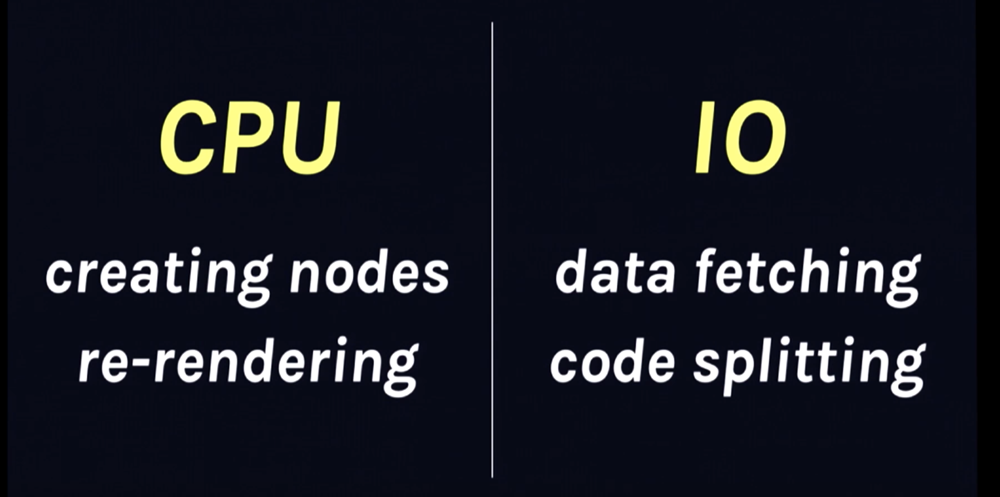

# Dan Abramov: Beyond React 16 | JSConf Iceland 2018

> [视频地址](https://www.youtube.com/watch?v=nLF0n9SACd4&t=1803s)

Dan 从 CPU 和 IO（网络层） 两个方面描述了未来 React 的异步特性：



## Git 隐喻

大会上，Dan 通过一个 Git 隐喻作为后续分享内容的引子：

生活中如果没有版本控制，那么所做的一切都是串行的，下一步需要等待上一步的完成，并且也无法实现 undo：


而如果引入了版本控制，我们可以新建一个分支进行新特性的开发：


当需要紧急修复 bug 时，我们也可以在 master 上立马作出修改：


之后，rebase 并继续特性的开发：


## 

## CPU：Time Slicing

例子，输入框键入内容时，下方的图表执行更新：


以前的 React 更新 Dom 有两个特点：

1. 同步更新
2. 没有区分事件的优先级

在这个例子中，用户输入就应当是一个高优先级的事件，任何细小的输入延迟或者卡顿都会造成用户体验降低。

新的 React 保证当**低优先级的更新**引起渲染时，**高优先级的更新（如用户输入）**不会被阻塞。

特点：

- 渲染时，React 不会阻塞线程
- 设备性能足够好时，一切操作感觉是同步的
- 设备性能一般时，一切操作是响应式的
- 只有最后渲染的状态会被展示
- 相同的声明式组件模型

将 CPU 一例回归到 Git 隐喻上就是：

没有 time slicing 的 React，更新操作是同步的，不可被打断：


具有 time slicing 的 React，低优先级的更新能够自动被 rebase，不会阻碍高优先级的更新：


## IO：Suspense

IO 层面，面临的挑战就是网络，如何更好地组织异步流程一直是 React 开发者探索的点。Dan 接下来的 IO Demo 展示了在未来，React 原生支持异步任务的能力。

这是一个 Movie app，首页会加载并展示的电影列表：


单击列表项，将进入电影详情页面，加载并展示电影详情：


在原始的实现中，我们有一个状态量 `showDetail` 标识是否应当展示详情：

```jsx
handleMovieClick = (id) => {
    this.setState({
        currentId: id,
        showDetail: true
    })
}

render() {
    const { currentId, showDetail } = this.state;
    return (
    	<div className="App">
        	{showDetail ? this.renderDetail(currentId) : this.renderList() }
        </div>
    )
}
```

点击列表项的影片，我们就进入详情页，等待影片详情拉取完毕，这个异步操作

有趣的是，React 已经着手原生支持组件的异步化了。首先，我们需要一个 fetcher 进行异步数据的获取，未来，React 会提供一个工厂函数帮助我们创建一个和 React 组件交互的 fetcher：

```js
const movieDetailsFetcher = createFetcher(
	fetchMovieDetails
)
```

然后，在需要影片详情的组件中，获取数据，这需要借助于 fetcher 的 `read` 方法：

```jsx
function MovieDetails(props) {
    const movie = movieDetailsFetcher.read(props.id)
    return (
    	<div className="MovieDetails">
        	<MoviePoster src={movie.poster} />
            <h1>{movie.title}</h1>
            <MovieMetrics {...movie} />
        </div>
    )
}
```

fetcher 首先会尝试从缓存中获得数据，如果获取不到，再通过传给工厂方法的 `fetchMovieDetails` 的函数获取数据。只有当数据获取完毕，组件才会渲染。

此时，点击列表项时，就需要延后设置状态（等待详情加载完毕），React 未来也会提供 `deferSetState` 来完成这件事:

```jsx
handleMovieClick = (id) => {
    this.setState({
        currentId: id
    })
    
    this.deferSetState({
        showDetail: true
    })
}
```

不需要担心这会阻塞 UI，详情在加载，你的 UI 也是可以交互的。更进一步，React 将提供一个 `Placeholder` 组件，它能够在数据加载完成前，声明占位行为：

```jsx
renderDetail(id) {
   <Placeholder
     delayMs={1500}
     fallback={<Spinner size="large" />}
   >
   		<MoviePage id={id} />
   </Placeholder>
}
```

当数据加载超过 1500 ms，就会渲染一个大大的 `<Spinner />`。

接下来还可以优化电影详情页的海报，我们让海报的加载也异步化：

```jsx
const imageFetcher = createFetcher(
    (src) => new Promise(resolve => {
		const image = new Image();
        image.onload = () => resolve(src);
        image.src = src;
    })
)

function Img(props) {
    return (
        
    )
}

function MoviePoster(props) {
    return (
    	<div className="MoviePoster">
        	
        </div>
    )
}
```

React 提出的 IO Suspense 的特点为：

- 暂停任何状态更新，直到数据准备完毕
- 原生支持异步组件
- 网络状况好时，在整个 tree 准备完毕时才进行渲染
- 网络状况不佳时，可以精确控制加载态
- React 将提供 high-level API 供业务开发者使用，而提供 low-level API 供库开发者使用

Suspense 同样可以回归到 Git 隐喻：


