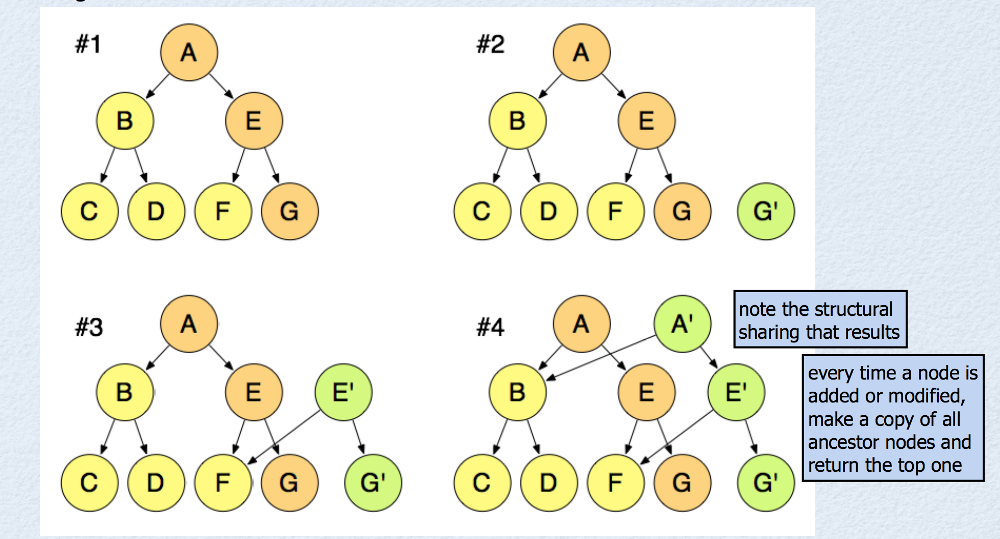
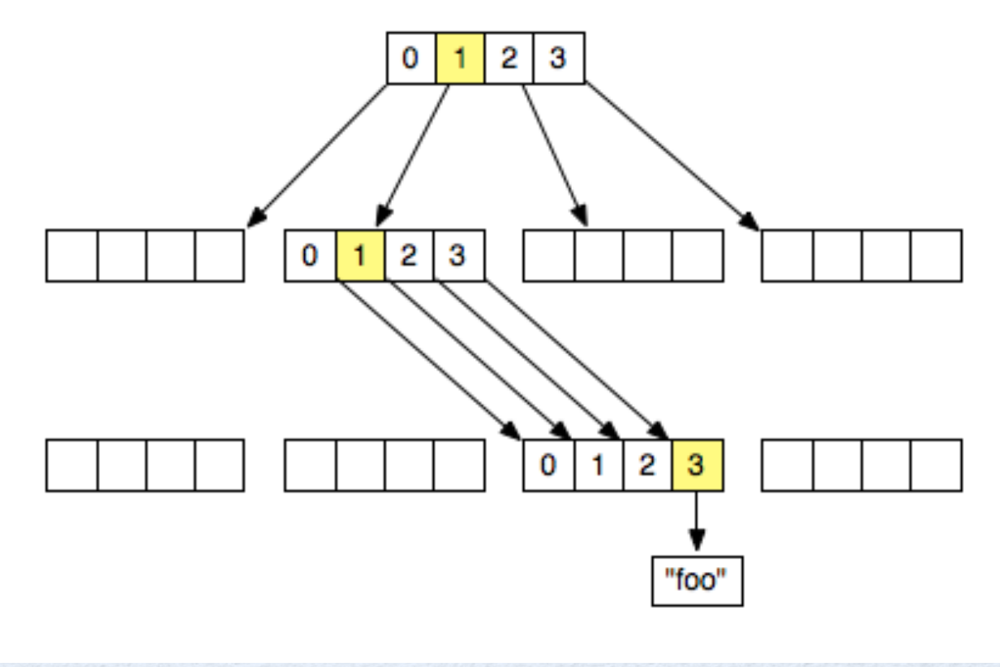
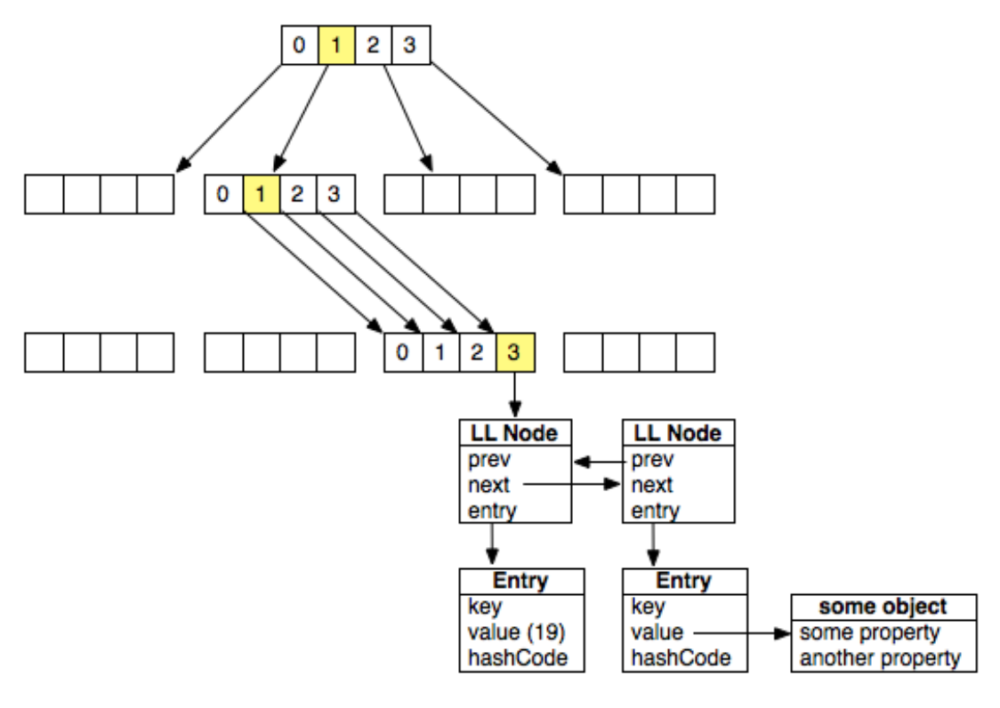

# Immutable Data（不可变数据）

## 定义

- 不可变数据在创建后无法进行修改
- 每次 “修改” 都是创建数据的新版本

## 实现

### structural sharing

使用 **structural sharing** 来高效的（ImmutableJS 就使用了这个算法提升性能）创建数据结构的新版本，典型的实现有：

- **index tries**
- **hash array map tries**

使用了 **DAG（Direct Acyclic Graph — 有向无环图）**：



当 `G` 节点被修改后，重新创建其祖先的所有父辈，并返回最顶层的祖先 `A'`。

**Trie** 是一种特殊的 DAG，将使用 **index trie** 来构造数组，而使用 **hash array mapped trie（HAMT）** 来构造 set 和 map。

###Index Trie

- 各个节点是**大小固定的指针序列**，指向了别的节点或者值：



​	(1) 在 53 索引位置存储了 `"foo"`

​      (2) 53 转化为二进制为 110101

​      (3) 从最低位开始形成的形成的 pair 为 01，01，11，转化为 10 进制就是 1，1，3。此时我们就能定位到 `"foo"` 的祖先。

​      (4) 如果给定了索引位置，也可以据此得到值

- 在指定位置处设定新的值，需要使用上文描述的 DAG 来创建节点及其祖先的副本，其余部分则保持不变。
- 值只有在 trie 的末尾才能高效地删除或者插入（头部或者中部插入时，将修改后续所有节点的位置）

### Hash Array Mapped Trie



- 节点数组中的值（slot）由三种可能

  - 空（undefined）
  - 引用到其他 trie 节点
  - 引用到一个**链表节点（linked list node）**

- 链表节点的数据结构包含

  - **prev**：指向上一个链表节点
  - **next**：指向下一个链表节点
  - **entry**：指向一个 entry 节点。entry 节点包含了元素的 **key**、**value** 以及 key 的 **hash code**。

- 添加或者删除 entry 时

  - 将返回一个新的 hamt，新版本也将和上一个版本进行 structure sharing
  - 拷贝一个 trie 节点时，可以拷贝引用到的链表节点

- Hash 编码 key 的问题：

  - 需要撰写 hash code 计算函数
  - 如果 key 是其他原始数据类型（例如 number 或者 boolean），可以先通过 `toString` 方法将其转化为字符串，再进行 hash
  - 如果 key 是复合对象，那么 hash code 也应当通过属性混合进行计算

  

## 优势

在  [JavaScript Immutability presentation (PDF - see slide 12 for benefits)](https://www.jfokus.se/jfokus16/preso/JavaScript-Immutability--Dont-Go-Changing.pdf) 中，作者概括了 Immutable Data 的优点有：

- 远离副作用
- 更容易撰写纯函数
- 更快的修改检测
- 可以轻松缓存（一旦缓存，不允许任何代码进行修改，这份缓存是安全的）
- 更容易实现 undo
- 并发友好

## 劣势

- 性能损耗：创建数据的新版本需要耗费时间；检索性能也相对可变数据较低。
- 内存损耗：structure sharing 要求更高的内存。
- 学习曲线：JavaScript 原生的集合 API 无法再使用，需要学习新的 API。

## 为什么 Redux 会要求不可变性

1. Redux 和 React-Redux 都会使用浅比较（shallow checking）：
  - Redux 的 `combineReducers` 进行了浅比较。
  - React-Redux 的 `connect `  进行了浅比较。

2. Immutable data 使得对数据的操作更加安全（一个时刻应用只有一个状态）。
3. Time-travel debug 需要 reducer 是没有副作用的纯函数，不可变数据让你随意切换状态，也就切换了应用时刻。

## `combineReducers` 中的浅比较

`combineReducers` 接收一个 `reducers` 键值对来合并操纵了不同状态子树的 reducer：

```javascript
combineReducers({ todos: myTodosReducer, counter: myCounterReducer })
```

`combineReducers` 返回的 reducer 将根据 `reducers`  的 key/value 进行迭代：

```js
let hasChanged = false
const nextState = {}
for (let i = 0; i < finalReducerKeys.length; i++) {
    const key = finalReducerKeys[i]
    const reducer = finalReducers[key]
    const previousStateForKey = state[key]
    const nextStateForKey = reducer(previousStateForKey, action)
    if (typeof nextStateForKey === 'undefined') {
        const errorMessage = getUndefinedStateErrorMessage(key, action)
        throw new Error(errorMessage)
    }
    nextState[key] = nextStateForKey
    hasChanged = hasChanged || nextStateForKey !== previousStateForKey
}
	return hasChanged ? nextState : state
}
```

- 根据 key，获得对应状态子树的引用
- 调用对应的 reducer，并传入对应的状态子树
- 获得 reducer 调用后返回的状态子树

在迭代过程中，`combineReducer` 会创建一个新的 state object，新的状态由各个状态子树所构成。此时，`combineReducer` 使用**浅比较（`nextStateForKey !== previousStateForKey`）**检查状态子树是否发生了改变。

迭代完成后，倘若任何状态子树发生了改变，就认为应用状态发生了改变，将返回新的状态对象。

概括说来，如果每个 reducer 都返回了传入的状态子树，那么 `combineReducers` 将返回当前的根状态对象。

## `connect` 中的浅比较

React-Redux 中也使用了浅比较来决定其连接的组件是否需要被重新渲染。为此，被包裹的组件需要是一个 pure component（相同 props 和 state 总返回同样的结果）。

假定被包裹的组件是 pure 的，每次 `connect` 被调用时，首先检查其保存的 root state 是否发生了改变：

- 没有改变：没有必要进行重新渲染，因为状态不变，则状态映射的属性就不变，`mapStateToProps` 也就没必要调用
- 变了：此时不确定所映射的属性是否变化，因此需要调用 `mapStateToProps` 进行检测。对于 `mapStateToProps` 返回值，其进行浅比较的是返回对象中的**每个值的引用**，而不是返回的对象的引用。

之所以是检查**每个值的引用**，而不是检查对象引用，是因为每次调用 `mapStateToProps` 总是返回新的对象引用，比较对象引用就变得没有意义：

```js
function mapStateToProps(state) {
  return {
    todos: state.todos, // prop value
    visibleTodos: getVisibleTodos(state) // selector
  }
}

export default connect(mapStateToProps)(TodoApp)
```

## 在 Redux 中，对可变对象使用浅比较，是否会造成问题 ？

在 Redux 中，对可变对象使用浅比较，不会造成问题，但会对依赖的 store 的库，例如 React-Redux 造成问题。

举个例子，假如我们传入 reducer 的对象是一个可变对象，并且直接返回它，那么 `combineReducers` 就会通过浅比较，若所有的 reducer 都返回的是同一个可变对象的引用，`hasChanged` 就仍然是 `false`，`combineReducers` 将返回老的状态对象，由于老的状态对象改变了，所以数据本身也没啥问题。但是由于 root state 没变，React-Redux 就认为不需要进行组件的重新渲染，因此，即便数据确实发生了改变，UI 也不会得到响应。

## 为什么 `mapStateToProps` 返回的数据变了，也没引起组件的 re-render

我们知道，React-Redux 进行变更判断是**浅比较的 `mapStateToProps` 返回对象中的各个值**，因此，若各个值的引用没变，也不会驱动组件的 re-render：

```js
// State object held in the Redux store
const state = {
  user: {
    accessCount: 0,
    name: 'keith'
  }
}

// Selector function
const getUser = state => {
  ++state.user.accessCount // mutate the state object
  return state
}

// mapStateToProps
const mapStateToProps = state => ({
  // The object returned from getUser() is always
  // the same object, so this wrapped
  // component will never re-render, even though it's been
  // mutated
  userRecord: getUser(state)
})

const a = mapStateToProps(state)
const b = mapStateToProps(state)

a.userRecord === b.userRecord
//> true
```

## reducer 中的不可变性会造成不必要的渲染

若 reducer 返回的新状态子树数据没变，只是引用变了，`combineReducer` 就会返回新的 root state，React-Redux 就会得到响应，可能进行组件的重新渲染。

为了避免这种场景，如果状态子树进入 reudcer 没有发生改变，就应当直接返回它。

## `mapStateToProps` 中的不可变性造成不必要的渲染

诸如 `Array.prototype.filter` 这样的操作总会返回新的引用，因此，即便这些操作没有改变集合的数据，还是会返回新的引用，这可能造成 `mapStateToProps` 返回对象的值没有通过**浅比较**，在数据未发生变化时仍然重新渲染：

```js
// A JavaScript array's 'filter' method treats the array as immutable,
// and returns a filtered copy of the array.
const getVisibleTodos = todos => todos.filter(t => !t.completed)

const state = {
  todos: [
    {
      text: 'do todo 1',
      completed: false
    },
    {
      text: 'do todo 2',
      completed: true
    }
  ]
}

const mapStateToProps = state => ({
  // getVisibleTodos() always returns a new array, and so the
  // 'visibleToDos' prop will always reference a different array,
  // causing the wrapped component to re-render, even if the array's
  // values haven't changed
  visibleToDos: getVisibleTodos(state.todos)
})

const a = mapStateToProps(state)
//  Call mapStateToProps(state) again with exactly the same arguments
const b = mapStateToProps(state)

a.visibleToDos
//> { "completed": false, "text": "do todo 1" }

b.visibleToDos
//> { "completed": false, "text": "do todo 1" }

a.visibleToDos === b.visibleToDos
//> false
```

这时，我们可以考虑使用 [ReSelect](https://github.com/reduxjs/reselect) 这样的库来避免创建新的引用，从而避免组件被判定为需要重新渲染。

## 参考资料

- [Immutable Data](https://redux.js.org/faq/immutable-data#benefits-of-immutability)
- [JavaScript Immutability presentation (PDF - see slide 12 for benefits)](https://www.jfokus.se/jfokus16/preso/JavaScript-Immutability--Dont-Go-Changing.pdf) 
- [React.js pure render performance anti-pattern](https://medium.com/@esamatti/react-js-pure-render-performance-anti-pattern-fb88c101332f)