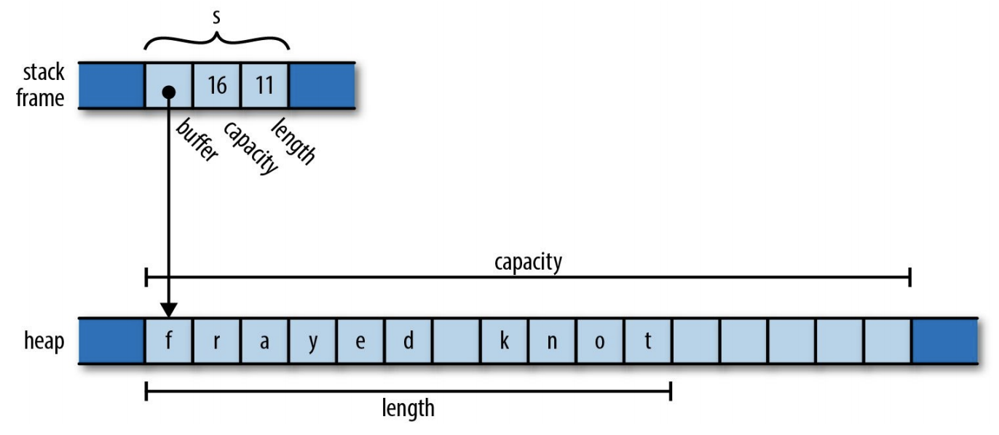
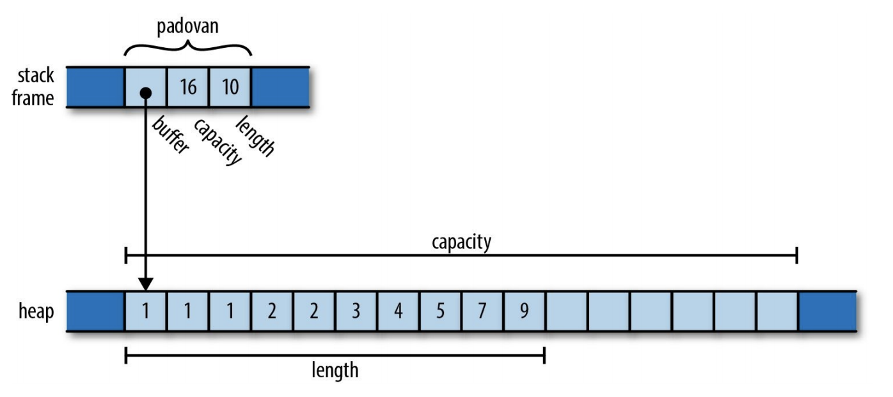
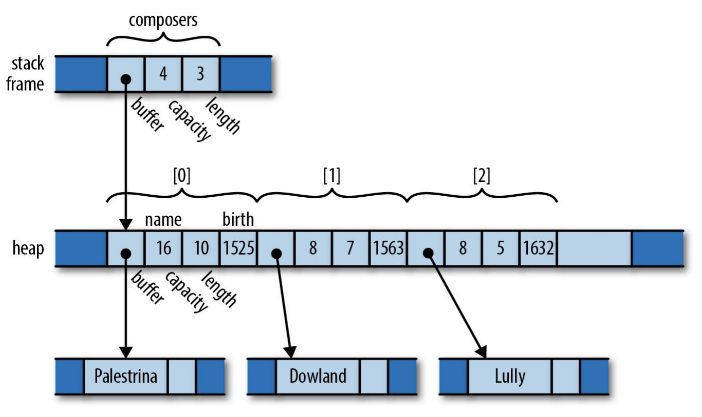
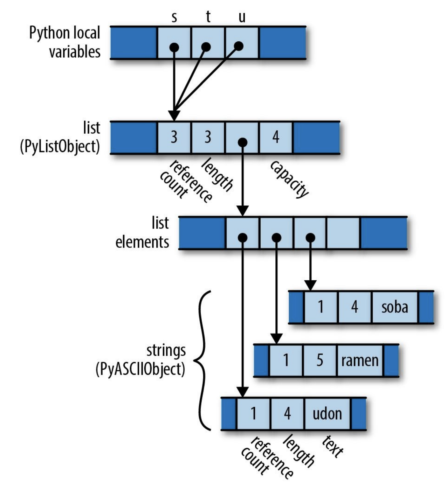
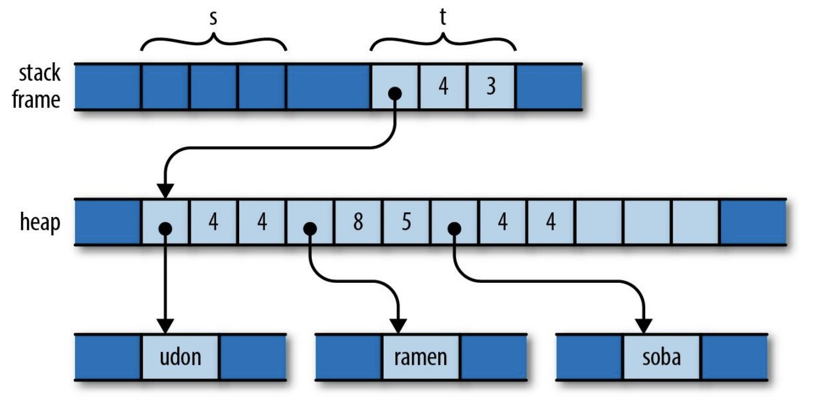
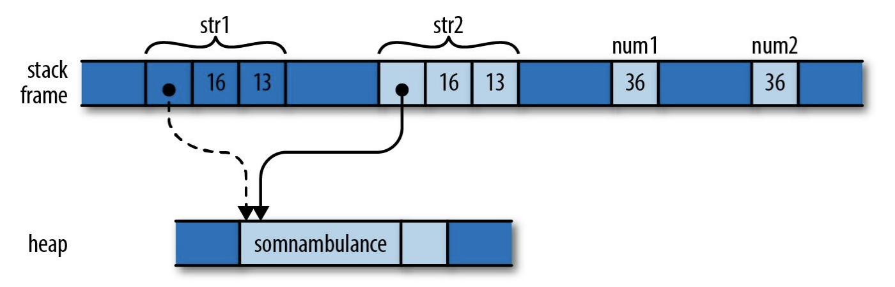

# Ownership（所有权）

Rust 通过「所有权（Ownership）机制」和「对引用的使用约束」来让自己成为一个安全的语言，它坚持认为：

- 开发者可以自行决定程序中每个变量的生命期（lifetime），Rust 会在适当的时候清理这些变量所占用的资源。
- 但一个对象被清理后，程序不会再使用指向它的指针，这能够避免在 C 或者 C++ 中常常出现的悬摆指针（dangling pointer）问题。

而 C 或者 C ++ 则认为：

-  开发者可以随意使用 `free` 或者 `delete` 清理在堆上动态分配的内存
- 👆这样的自由，常常造成开发者忘记做清理，尤其是在程序规模逐渐变大后。

为了减负开发者心智，很多语言通过垃圾回收（garbage collection）机制来自动清理对象资源，但是 GC 不但会带来更多运行时的开销，开发者也会常常诧异，为什么我的资源该回收了，却没有被回收。

## 什么是所有权

Rust 引入了所有权（Ownership）机制来保障内存安全，开发者不能再代码中随意地操作指针，如果开发者遵循了约定（编译期不会报错），那么 Rust 将为开发者负责资源回收。

在 C++ 中，我们可以使用如下的代码创建一个字符串对象：

```c++
std::string s = "frayed knot";
```

它在内存中的表示会是：



`s` 是一个栈上分配的对象，它所占用的栈空间包含了：

- `pointer`：指向堆上字符串序列开头的指针
- `capacity`：堆上为该字符串分配的空间打下
- `length`：当前字符串的长度

`s` 是堆上内存 buffer 的所有者，当程序某个时间销毁了 `s`，那么 `s` 的析构函数也会清理 buffer 占用的空间。因此在 C++ 中，所有者决定了其所拥有的值的生命期。

Rust 也遵循了这个准则，并且将其「显式地」 提到了代码层面。在 Rust 中，每个值都对应一个所有者，当所有者被丢弃（dropped），那么值所占用的空间也会被清理：

```rust
fn print_padovan() {
  let mut padovan = vec![1, 1, 1];
  for i in 3..10 {
    let next = padovan[i-3] + padovan[i-2];
    padovan.push(next);
  }
  println!("P(1..10) = {:?}", padovan);
}
```

`padovan` 在内存中的表示如下：



当 `padovan` 离开函数作用域之后，就会被丢弃，其所拥有的 vector buffer 也会被清理。

下面这个代码则反映了更复杂的所有权：

```rust
struct Person { name: String, birth: i32 }

let mut composers = Vec::new();
composers.push(Person { name: "Palestrina".to_string(), birth: 1525 });
composers.push(Person { name: "Downland".to_string(), birth: 1563 });
composers.push(Person { name: "Lully".to_string, birth: 1632 });

for composer in &composers {
  println!("{}, born {}", composer.name, composer.birthday);
}
```



`composers` 拥有了一个 vector，这个 vector 又拥有了一个元素序列，每个元素都是一个 `Person` struct，这个 `Person` struct 又拥有了若干 field，如 `name` 和 `birth`，当 `composers` 被丢弃，这些资源也会都丢弃。这个所有权关系直观上构成了一棵 “所有权树”。

Rust 不允许开发者显式地通过 `free` 和 `delete` 来销毁资源，而是通过编程约定：

- 变量离开作用域，它会被销毁
- 当 vector 中某个元素被删除后，这个元素会被销毁

- 诸如此类

据此，Rust 可以保障每个资源都被正确地销毁，资源所占用的资源也被正确销毁。

除此之外，Rust 还扩充了：

-  开发者可以转移值得所有权到其它所有者
- 标准库提供了 `Rc` 和 `Arc` 两个引用计数指针，让值可以同时拥有多个所有者
- 开发者可以通过 「借用一个值的引用」来消费值，引用是 nonowning 的指针（非占有的指针，当所有者被丢弃，其引用的内容不会被销毁），并且只有有限的生命期（存活时间）

## 转移所有权

在 Python 中，下面的代码，我们尝试将一个数组赋值给多个变量：

```python
s = ['udon', 'ramen', 'soba']
t = s
u = s
```

Python 每个对象都有一个引用计数属性，标识了当前有多少变量引用了它：



而在 C++ 中，进行类似的赋值：

```c++
using namespace std;
vector<string> s = { "udon", "ramen", "soba" };
vector<string> t = s;
vector<string> u = s;
```

与 Python 采用引用计数不同的是，C++ 使用了拷贝来处理上面的赋值，现在，堆上分配了三个 vector：


Rust 尝试上面的赋值过程：

```rust
let s = vec!["udon".to_string(), "ramen".to_string(), "soba".to_string()];
let t = s;
let u = s;
```

在内存中，Rust 既不像 Python 那样使用引用计数，也不像 C++ 那样在堆上复制，而是转移了 vector 的所有权：



当我们把 `s` 再赋值给 `t` 时，vector 的所有权也被「转移」到了 `t`，此时 `s` 不再有效，因此上述的代码会在编译器报错：

```bash
error[E0382]: use of moved value: `s`
 --> src/main.rs:4:11
  |
3 |   let t = s;
  |           - value moved here
4 |   let u = s;
  |           ^ value used here after move
```

当然 Rust 也可以通过 `Rc` 或者 `Arc` 实现 Python 那样的引用计数，让一个堆上分配的对象被多个变量拥有：

```rust
use std::rc::Rc;

let s: Rc<String> = Rc::new("shirataki".to_string());
let t: Rc<String> = s.clone();
let u: Rc<String> = s.clone();
```

也可以通过 `clone` 来实现 C++ 那样的堆上拷贝：

```rust
let s = vec!["udon".to_string(), "ramen".to_string(), "soba".to_string()];
let t = s.clone();
let u = s.clone();
```

## 例外：Copy Trait

不过，一些实现了 Copy Trait 的对象在赋值中，不会进行转移所有权，例如一些数字类型，因为它们的长度固定，在栈上直接拷贝的成本是非常低的：

```rust
let str1 = "somnambulance".to_string();
let str2 = str1;

let num1:i32 = 36;
let num2 = num1;
```



