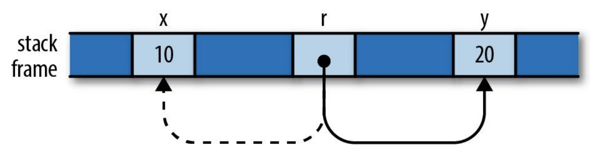
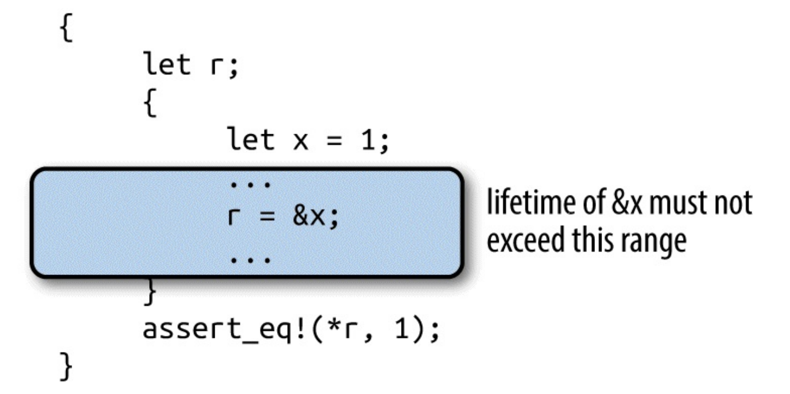
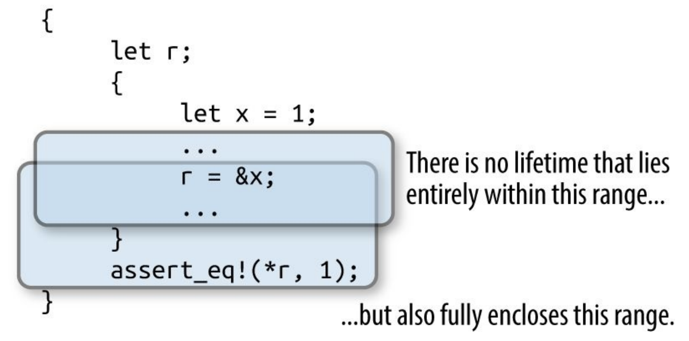

# Reference（引用）

Rust 使用了所有权机制来描述资源的从属关系，彼时彼刻，一个资源只能被一个所有者持有，如果要被其他人持有，那么就需要转移所有权：

```rust
fn main() {
  let x = String::from("Hello");
  print(x);
  println!("x in main {}", x);
}

fn print(x: String) {
  println!("x in print {}", x);
}
```

当我们调用了 

```rust
print(x);
```

后，String `"Hello"` 的所有权发生了转移，以至于后续还想消费 `x`对应的值时，Rust 在编译期给出警告：

```
 --> src/main.rs:4:28
  |
2 |   let x = String::from("Hello");
  |       - move occurs because `x` has type `std::string::String`, which does not implement the `Copy` trait
3 |   print(x);
  |         - value moved here
4 |   println!("x in main {}", x);
  |                            ^ value borrowed here after move
```

对于资源，我们除了直接通过「所有权变动」来使用它，也可以通过引用来使用它，引用的长度固定，能够很高效地在「栈」上维护，我们「引用」一个资源，也不会修改资源的所有权关系，因此引用对资源的消费，也被称作了「借用（borrow）」：

```rust
let x = 10;
let y = 20;
let mut r = &x;
if b { r = &y; }
assert!(*r == 10 || *r == 20);
```



可以通过 `*` 解引用操作符获得引用指向的内容。

## 悬摆引用（Dangling Reference）

在诸如 C++ 这样的语言，经常会面对悬摆引用：当引用指向的资源已经被回收，但是引用仍然有效，但是指向了不可期的内存位置，引起 bug。Rust 避免悬摆引用的原则就是：资源一定要活得比引用够久：

```rust
let r;
{
  let x = 1;
  r = &x;
}
assert_eq!(*r, 1);
```

当 `x` 在块作用域末尾被回收后，我们在块以外，还尝试使用引用 `r`，Rust 就会在编译期报错：

```
error[E0597]: `x` does not live long enough
 --> src/main.rs:5:9
  |
5 |     r = &x;
  |         ^^ borrowed value does not live long enough
6 |   }
  |   - `x` dropped here while still borrowed
7 |   assert_eq!(*r, 1);
  |   ------------------ borrow later used here
```

Rust 认为 `x` 太短命了，以至于它自己都死亡了，对它的引用还存活着，这样就会形成悬摆引用，Rust 因此在编译期不允许这段代码通过。


Rust 希望对 `x` 的引用 `&x` 生命期不应该超过下图中蓝色范围，否则 `x` 销毁后将会出现悬摆引用：



同时又希望 `r` 指向的资源存活范围是下图蓝色部分，即它指向的资源至少要和它活的一样长：


但是，同时满足这两个约束的生命期无法找到，Rust 因此报错：



## 告诉 Rust 引用能活多久

多数情况下，Rust 能通过 Borrow Checker 检查「引用与引用内容」的生命期长短，但是，也有例外，比如下面这个代码：

```rust
fn main() {
  let x = "Hello";
  let y = "Hi";
  println!("The longest string is {}", longest(&x, &y));
}

fn longest(x: &str, y: &str) -> &str {
  if x.len() > y.len() {
    x
  } else {
    y
  }
}
```

Rust 会在编译期报错：

```
error[E0106]: missing lifetime specifier
 --> src/main.rs:7:33
  |
7 | fn longest(x: &str, y: &str) -> &str {
  |               ----     ----     ^ expected named lifetime parameter
  |
  = help: this function's return type contains a borrowed value, but the signature does not say whether it is borrowed from `x` or `y`
help: consider introducing a named lifetime parameter
  |
7 | fn longest<'a>(x: &'a str, y: &'a str) -> &'a str {
  |           ^^^^    ^^^^^^^     ^^^^^^^     ^^^
```

这是因为，Rust 无法知道 `longest` 返回的引用到底是 `&x` 还是 `&y`，因此也就无法比较返回的引用和引用内容的生命长度。这时，就需要开发者自行声明引用的生命期：

```rust
fn main() {
  let x = "Hello";
  let y = "Hi";
  println!("The longest string is {}", longest(&x, &y));
}

fn longest<'a>(x: &'a str, y: &'a str) -> &'a str {
  if x.len() > y.len() {
    x
  } else {
    y
  }
}
```

## 结构体中的引用生命期

如果结构体中的属性是引用类型，我们要注意为其声明生命期，避免「结构体销毁了，属性引用」仍然存在造成的悬摆引用问题：

```rust
struct S {
  x: &i32,
  y: &i32,
}

fn main() {
  let x = 10;
  let y = 20;
  let r = 0;
  let s = S { x: &x, y: &y };

  println!("sum is {}", sum_r_xy(&r, s));
}

fn sum_r_xy(r: &i32, s: S) -> i32 {
  r + s.x + s.y
}
```

尝试编译这段代码，Rust 会报错：

```
error[E0106]: missing lifetime specifier
 --> src/main.rs:2:6
  |
2 |   x: &i32,
  |      ^ expected named lifetime parameter
  |
help: consider introducing a named lifetime parameter
  |
1 | struct S<'a> {
2 |   x: &'a i32,
  |

error[E0106]: missing lifetime specifier
 --> src/main.rs:3:6
  |
3 |   y: &i32,
  |      ^ expected named lifetime parameter
  |
help: consider introducing a named lifetime parameter
  |
1 | struct S<'a> {
2 |   x: &i32,
3 |   y: &'a i32,
```

试想，如果 `&x` 或者 `&y` 引用的内容销毁了，结构体 `s` 还活着，那么 `s.x` 和 `s.y` 就会变成悬摆引用，因此，需要为结构体的引用属性声明生命期：

```rust
struct S<'a,'b> {
  x: &'a i32,
  y: &'b i32,
}

fn main() {
  let x = 10;
  let y = 20;
  let r = 0;
  let s = S { x: &x, y: &y };

  println!("sum is {}", sum_r_xy(&r, s));
}

fn sum_r_xy(r: &i32, s: S) -> i32 {
  r + s.x + s.y
}
```

## 使用引用的规则

为了从源头上遏制数据竞争：

- 资源同时可以拥有多个不可变引用
- 资源同时只能拥有一个可变引用

```rust
let mut s = String::from("hello");

let r1 = &s; // no problem
let r2 = &s; // no problem
let r3 = &mut s; // BIG PROBLEM
```

但一定要注意，这里强调的是同时：

```rust
let mut s = String::from("hello");

let r1 = &s; // no problem
let r2 = &s; // no problem
println!("{} and {}", r1, r2);
// r1 and r2 are no longer used after this point

let r3 = &mut s; // no problem
println!("{}", r3);
```


